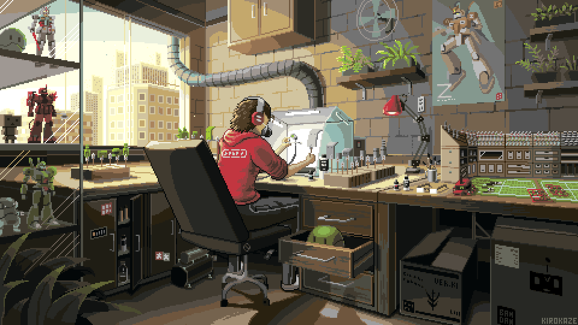

  
  

  <a href="#"><h1 align="center"><b>Hi, I'm Emanuel. Welcome, and thank you for your visit! </b></h1>

 

  

## Hi there!

I'm currently doing internships as a **backend and frontend developer**.  
I'm learning **Docker, Angular, and GSAP** to enhance my skills.  
I'm looking to collaborate on **front-end web & app development projects**.  
I'm open to **new and better opportunities** to grow as a developer.  

## 💻 TECNOLOGIAS Y HERRAMIENTAS 

 

 

 

  
  

  

