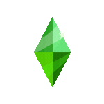

  EMANUEL ROBINSON

 <!-- ono -->
  

<h3>Lenguajes</h3>

    
    
    
    
    
    
    
    
    
  

<h3>Frameworks y librerias</h3>

<!--**i like writing code**  **and Ahtipia's burger.** -->

---

  
  
  

  
  
  
  

